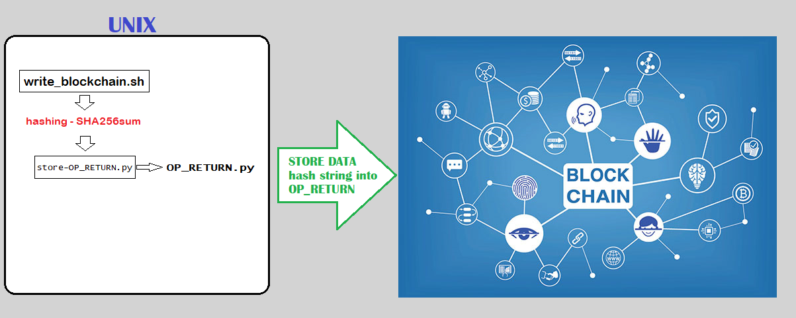
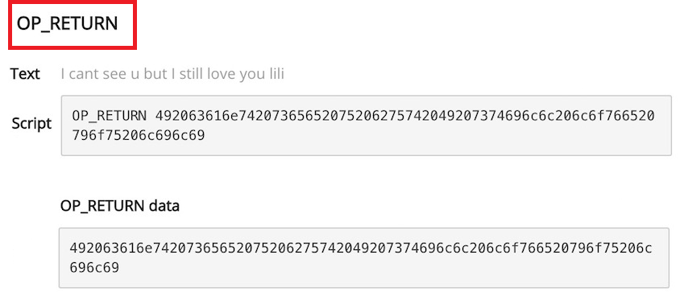

✓ Author: Mattia Pedroncelli© - Date: 2018  mattia.pedroncelli@gmail.com

# > PROCESSO PER SALVATAGGIO DI UN MESSAGGIO SULLA BLOCKCHAIN

## ❶ Introduzione.
Questo progetto prevede la definizione di un processo batch per la scrittura di un determinato messaggio dato in input sulla Blockchain.
 

## ❷	Come funziona.

Il servizio non scrive sulla blockchain i tuoi dati in chiaro, bensì in forma offuscata ed aggregata mediante un processo di hashing, in modo da non rendere possibile risalire al dato originale. Il dato scritto in blockchain è chiamato Merkle Root ed è il risultato di un processo di aggregazione noto con il nome Merkle Tree.

#### Cos’è il Merkle Tree ? 

In letteratura informatica, un hash tree o merkle tree è una struttura ad albero le cui foglie rappresentano blocchi di dati sotto forma di hash, una funzione non invertibile che mappa una stringa di lunghezza arbitraria in una stringa di lunghezza minore. La caratteristica principale del merkle tree è di permettere una verifica efficiente e sicura di strutture dati di grandi dimensioni.
Dimostrare l’appartenenza di una data foglia (dato di input) ad un merkle tree necessita infatti un numero di computazioni proporzionale al logaritmo del numero delle foglie di quel determinato merkle tree.
 
## ❸ Schema architettura processo.

 

# > DATA STORAGE NELLA BLOCKCHAIN CON OP_RETURN

## ❶	Che cos'è OP_RETURN.

Nella blockchain, oltre all’indirizzo mittente e destinazione della transazione, è presente un campo “libero” dove è possibile scrivere ciò che si vuole. Tale campo, chiamato **OP_RETURN**, permette la scrittura di 80 byte, cioè di 80 caratteri alfanumerici a piacere, che verranno legati per sempre alla transazione e possono contenere messaggi codificati in esadecimale.
Come il seguente esempio “I cant see u but I still love you lili” (tx):

Tecnicamente, il campo OP_RETURN è la modalità standard con la quale marcare una transazione come provably unspendable, inserendo una scriptPubKey del tipo “scriptPubKey: OP_RETURN {zero or more ops}” che fa sì che lo script venga identificato come invalido, garantendo che non possa esistere alcuna scriptSig in grado di spendere l’output. Dal punto di vista dell’impiego di risorse, le transazioni OP_RTURN sono l’ideale per non sovraccaricare la rete dato che gli output possono essere potenzialmente rimossi dalle cache di transazioni non spese, alleggerendo così l’intero sistema rispetto a modalità alternative di inserimento di dati nella blockchain.

L’idea è che grazie a questo campo, OP_RETURN, è possibile utilizzare il protocollo Bitcoin non soltanto per trasferimenti di moneta virtuale ma anche per contratti evoluti o servizi come Proof of Existence, che utilizzano la blockchain per fornire un sistema di timestamp di documenti sicuro ed economico, basato sull’inserimento dell’hash del documento da certificare temporalmente all’interno del campo OP_RETURN.

## ❷ Utilizzo di OP_RETURN con linguaggio Python.

Di seguito vengono indicati alcuni semplici comandi per l'utilizzo di OP_RETURN per generare transazioni da scrivere sulla Blockchain.
   

>REQUIREMENTS
* Python 2.5 or later (including Python 3)
* Bitcoin Core 0.9 or later
 
>BEFORE YOU START 
* Check the constant settings at the top of OP_RETURN.py. 
* If you just installed Bitcoin Core, wait for it to download and verify old blocks.
* If using as a library, add 'from OP_RETURN import *' in your Python script file.
 

### TO STORE SOME DATA IN THE BLOCKCHAIN USING OP_RETURNs

**On the command line:**

>* **python store-OP_RETURN.py** <**data> <testnet (optional)>**
> 
>  - data is a hex string or raw string containing the data to be stored 
>    (auto-detection: treated as a hex string if it is a valid one)   
>  - testnet should be 1 to use the bitcoin testnet, otherwise it can be omitted 
> 
>  - Outputs an error if one occurred or if successful, the txids that were used to store  
>    the data and a short reference that can be used to retrieve it using this library. 
>  
>  - Wait a few seconds then check http://coinsecrets.org/ for your OP_RETURN transactions. 
>  
> Examples:
> 
>  python store-OP_RETURN.py 'This example stores 47 bytes in the blockchain.' 
>  python store-OP_RETURN.py 'This example stores 44 bytes in the testnet.' 1
   
    
**As a library:**
 
>* **OP_RETURN_store(data, testnet=False)**
> 
>  - data is the string of raw bytes to be stored 
>    testnet is whether to use the bitcoin testnet network (False if omitted) 
>   
>  - Returns: {'error': '<some error string>'} 
>         or: {'txids': ['<1st txid>', '<2nd txid>', ...],
>              'ref': '<ref for retrieving data>'}
>             
> Examples:
>  
>  OP_RETURN_store('This example stores 47 bytes in the blockchain.')  
>  OP_RETURN_store('This example stores 44 bytes in the testnet.', True)
   
# > VERIFICA STORICIZZAZIONE TRANSAZIONE SULLA BLOCKCHAIN

  

